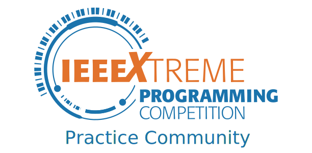

# IEEEXtreme

## What is IEEEXtreme ?
IEEEXtreme is a global challenge in which teams of IEEE Student members – advised and proctored by an IEEE member, and often supported by an IEEE Student Branch – compete in a 24-hour time span against each other to solve a set of programming problems.

## Folder Structure

- each folder is named IEEEXtreme `N`
- inside each folder you will find solutions for problems of that year's competition
- file name structure `IX_<N>_<problem_name>.<ext>`

## Contributions

- Only solutions that get full marks should be included here.
- You can verify if the code works at `https://csacademy.com/ieeextreme-practice/tasks/`
